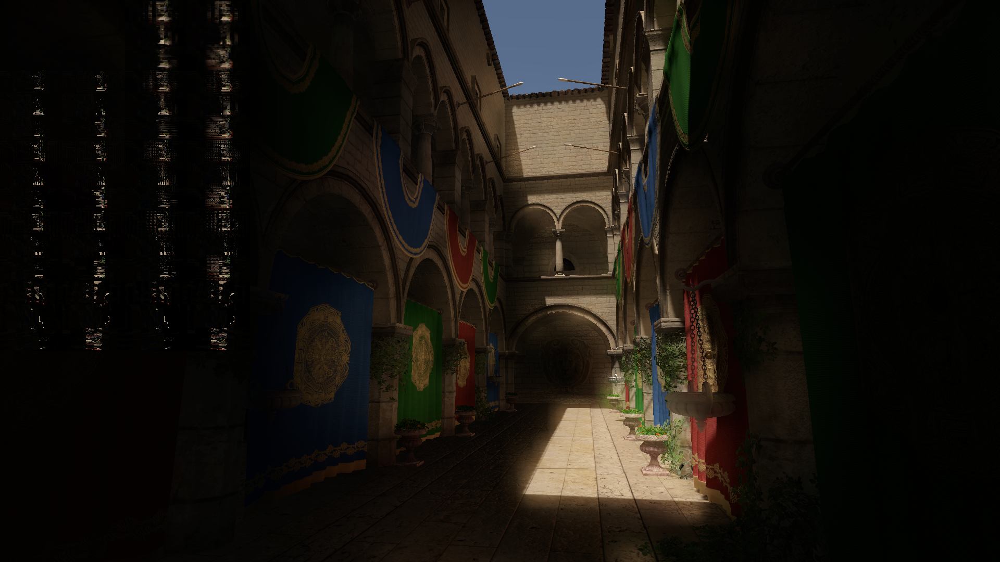

Radiance Cascades for Unity's URP
===

This project is a recreation of Alexander Sannikov's Radiance Cascades technique in Unity with an attempt to generalize it for 3D case.

# WIP

### Cornell box

### Sponza

References
----------
- [Radiance Cascades: A Novel High-Resolution Formal Solution for Multidimensional Non-LTE Radiative Transfer](https://arxiv.org/abs/2408.14425)
- [Youssef-Afella/RadianceCascadesUnity](https://github.com/Youssef-Afella/RadianceCascadesUnity)
- https://radiance-cascades.com/

License
-------
This project is MIT License - see the [LICENSE](LICENSE) file for details